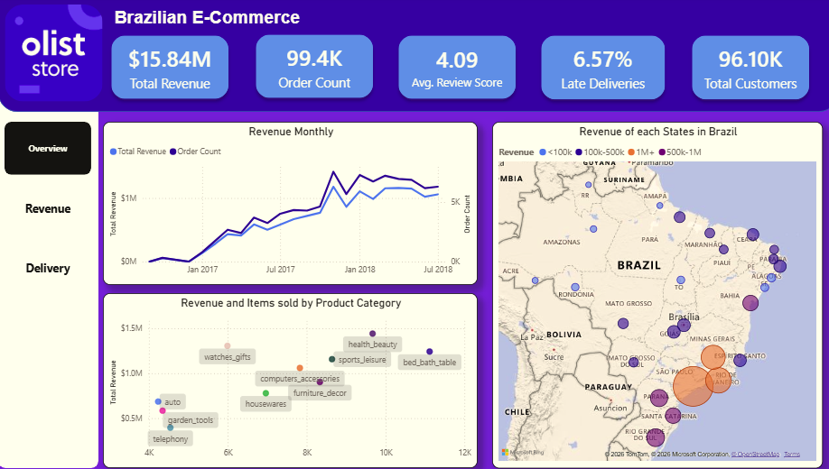
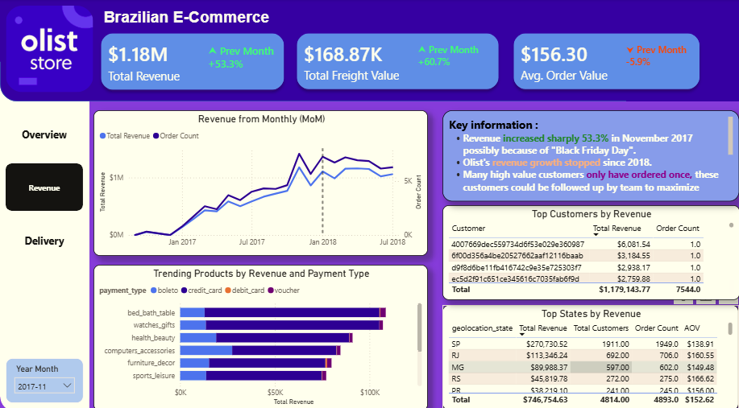
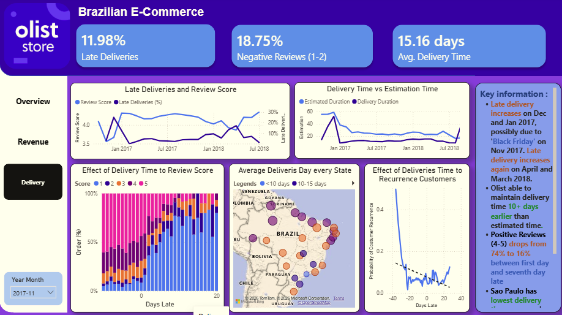

# Olist-Sales-Deliveries-Interactive-Dashboard
## 📌 Project Overview
This repository contains a comprehensive, interactive Business Intelligence dashboard built in **Microsoft Power BI** to analyze multi-dimensional retail performance from the **Olist Brazilian E-Commerce dataset**. The dashboard is organized into three core analytical views—**Overview**, **Revenue**, and **Delivery**—providing deep granular insights into marketplace sales trends, logistical efficiency, delivery bottlenecks, customer satisfaction and payment behaviors across Brazilian states.

## About Data and Data Cleaning
This analytic uses Olist's Data, an E-commerce in Brazil with period 2016-2018 sourced from Kaggle. Aug and Sept 2018 data are not used in visualization because the data doesn't complete. The raw data from Kaggle will be assesed and cleaned by using Python with library Pandas and Numpy resulting a clean structured, consistent, non-duplicate data and without anomalies. The cleaned data could be restructured as star schema for easier and simpler modeling purpose.

## 🛠️ Technical Stack & Skills Demonstrated
* **Tool:** Microsoft Power BI Desktop
* **Data Modeling:** Star Schema architecture connecting relational tables (`orders`, `order_items`, `customers`, `products`, `sellers`, `order_payments`, `order_reviews`, `geolocation`).
* **Data Transformation & DAX:** Power Query ETL, custom measures for time-intelligence, delivery duration calculations, and dynamic cross-highlighting.
* **UI/UX Design:** Custom dark-themed corporate dashboard layout, interactive page navigation, tooltips, and responsive month-year slicers.
---

## 🚀 Dashboard Pages & Key Features

### 1. 🌐 Overview Page

* **Features:** Executive KPI Summary Cards, Revenue & Order Growth (`Revenue Monthly`), Product Category Matrix (`Revenue and Items sold by Product Category`), Geographic Distribution (`Revenue of each States in Brazil`):

## 💡 Key Business Insights
1. **Lack of Recurrence Customers:** From Total order count of 99.4k there are only 96.1k customers, that mean only 3.3k (3%) repeat orders from customers.
2. **Revenue stop growing after 2018:** After sudden spike revenue on November 2017 (possibily due to Black Friday), the revenue stop to grow and flatten.
3. **Revenue concentrated around Sao Paulo:** Olist's revenue mostly from Sao Paulo and state's around it, this is normal thing since GDP and population of Brazillian also spreading similar as this revenue's map.

## 📈 Recommended Actionable Takeaways
1. **Reach out customers:** To increase recurence customers, team could followed up customer who doesn't order after long time by giving them reasonable discounts, promotions or showing products based on trends/last order.

**Watches_gifts Revenue**
2. **Maximizing watches_gifts product category:** Focus the marketing and promotion into watches_gifts product. Watches_gifts product category have second most of revenue despite ranked seventh in order count, also watches_gifts product's revenue are still growing until July 2018 unlike other categories that stop to grow.
3. **Maintain the center focus on Sao Paulo:** Keep the ads campaign and marketing relevant/focus to trends that are happening around these regions. 
---

### 2. 💰 Revenue Page

* **Features:** Filtered by Month-Year, Granular Financial KPI MoM, Trending Products by Payment Type, Top Customers & States, Key Findings. 

## 💡 Key Business Insights
1. **Revenue on Black Friday November:** Total Revenue Monthly increased 53.3% on Nov 2017 compared to Oct 2017, the sudden increase possibily from Black Friday and need to be analyzed deeper.
2. **Credit Card Revenue:** Among 4 payment types, "Credit Card" generates most of revenue (around 75%+).
3. **Top Customers Aren't Recurring:** Top customers who have high value order only have ordered once, these orders need to be analyzed deeper such as the review, products and their activities.
4. **Paulo And States Around It as Top States:** 60%+ of Olist total revenue based from these regions.    

## 📈 Recommended Actionable Takeaways
1. **Optimizing Black Friday:** Make a new event similar of Black Friday specifically for Olist brandsing to optimize revenue.
2. **Optimizing Credit Card:** Increase the security of credit card payment to prevent fraud transactions, add loyality program based on credit card, cooperate with related bank to secure better promotions/discounts.
3. **Reach Out Top Customers:** Reach out and offer an affordable discount or promotion to listed top customers since they have likelihood of high value order.
4. **Maintain the center focus on Sao Paulo:** Keep the ads campaign and marketing relevant/focus to trends that are happening around these regions.
5. **Add Bundling Order:** Add bundling order to increase AOV (Average Order Value).
---

### 3. 🚚 Delivery & Logistics Page

* **Features:** Filtered by Month-Year, Deiveries KPI MoM, Average, Top Customers & States, Key Findings. 

## 💡 Key Business Insights
1. **Review Score is Affected by Late Deliveries :** Positive reviews (4-5) drops from 74% to 15% between the first day and seventh day late deliveries
2. **Early Deliveries and Recurrence:** Early deliveries increases the probability of recurrence customers
3. **Average Delivery Time:** Olist average deliveries are 10+ days earlier than estimated time
4. **Normal Delivery Time each Region:** Throughout states in Brazil, Olist has reasonable average delivery time on each state that focused on Sao Paulo and the further the state from Sao Paulo, the delivery is also getting longer.

## 📈 Recommended Actionable Takeaways
1. **Adjust Estimated Deliveries Time:** Only 2117 out of 99441 orders have estimated delivery time correctly (-1 and 0 delay day). Adjusted estimated deliveries will have lower late deliveries and put more trust from customers
2. **Late Deliveries Spike in Mar and Apr 2018:** Analyze the reasons late deliveries happened in those months

---
